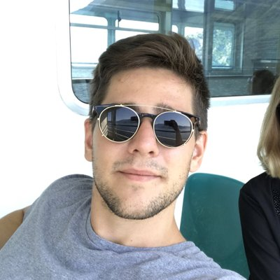

# Robin Frischmann's Speaker Profile

## Biography

Robin Frischmann is a frontend architect at dm-drogerie markt in Karlsruhe, Germany. 
He focuses on frontend architecture, functional UI and maintainable CSS. He loves JavaScript and especially its possibilities in terms of styling. 
Despite from coding, he studies psychology & computer science, practices yoga and enjoys trail running, vegan food and music.

## Avatar
There is a simple avatar (400x400) available at [https://github.com/rofrischmann/speaking/blob/master/avatars/avatar.jpg](https://github.com/rofrischmann/speaking/blob/master/avatars/avatar.jpg).

> More resolutions coming soon!